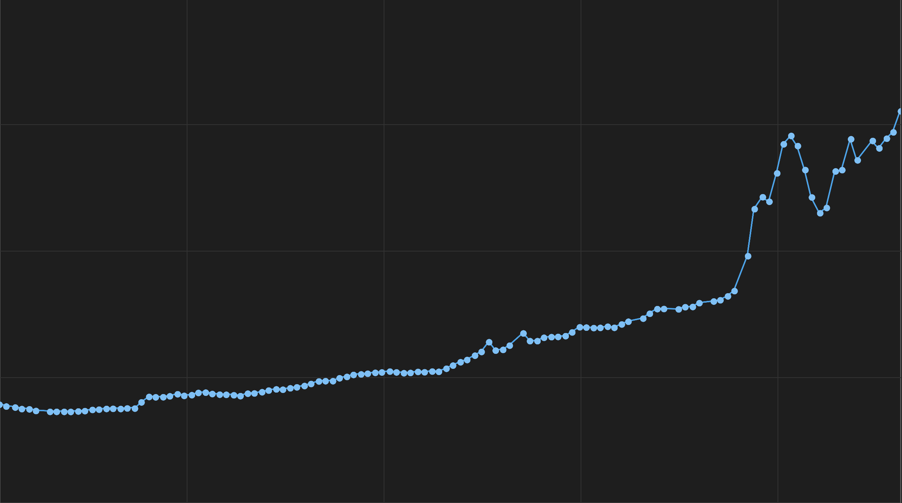

# FitSmith

FitSmith is a desktop GUI frontend for the [`fitz`](../fitz-cli/readme.md) FITS toolset. It
gives you a quick, interactive way to look through FITS (astronomy image) files without
dropping to the command line.

All FITS and image operations — reading, debayering, auto-stretching, header parsing and
pixel statistics — are performed by the shared [`fitz-core`](../fitz-core) library, so the GUI
and the CLI behave identically.

## What it does

 - **Working set** — open a single file or a whole directory and browse the files as a list.
   A file that fails to load is highlighted with a red background; hover it to see the error.
 - **Live preview** — images are displayed with debayer and auto-stretch if selected.
 - **Blink** — step or blink through the working set to compare frames; decoded images are
   kept in an LRU cache so re-selection and blinking re-render from memory.
 - **Inspect** — a Headers tab and a docked stats panel show the FITS metadata and pixel
   statistics for the selected frame.
 - **Compress / Decompress** — the Tools menu tile-compresses files to `.fz` (pick the
   algorithm) or decompresses them back. The operation runs over the checked rows, or the
   whole working set when none are checked. Choose whether to keep the originals or replace
   them in place (replaced files update to their new path in the list), or write the results
   to a different directory (which always keeps the originals).
 - **Export** — the Tools menu's Export… writes the working set (checked rows, or all when
   none are checked) into a destination folder in a chosen format, exporting each image
   exactly as the viewer shows it (the current debayer/stretch toggles are applied). A
   progress dialog tracks the batch. Per-format options:
     - **FITS** — bit depth (8-bit integer, 16-bit integer, or 32-bit float), plus optional
       tile compression with a chosen algorithm (RICE_1 / GZIP_1 / GZIP_2).
     - **TIFF** — bits per pixel (8, 16, or 32) and optional DEFLATE compression.
     - **JPEG** — encoder quality (1–100).
     - **PNG** — no options (written as 8-bit RGB).
 - **Analytics** — the Tools menu's Analytics… charts one pixel metric across the working set
   (checked rows, or all when none are checked) over the course of a session, to spot trends
   and problem frames — sky brightness creeping up as the night goes on, a jump in saturated
   pixels. Every metric is measured in a single read per file, so switching between them
   re-plots instantly with no re-read; a progress dialog tracks the batch and can cancel it.
   Drag the dialog's bottom-right corner to resize it.
     - **Metrics** — min, max, median and mean ADU; the number of pixels sitting exactly at the
       minimum or maximum ADU; noise sigma and noise MAD; sky background; and saturated pixels.
       Sky background is the frame's most common value, and saturated pixels are those at the
       pixel format's ceiling (65535 for 16-bit unsigned data, 255 for 8-bit).
     - **Noise sigma vs noise MAD** — both estimate the noise, but sigma is the standard
       deviation over every pixel, so stars and hot pixels inflate it, while MAD is a median
       of deviations and ignores them. Plotting both is the point: they track each other on a
       clean session, and sigma pulling away from MAD marks the frames where something else
       arrived — a satellite trail, a passing cloud lit by the moon, a tracking error.
     - **Time axis** — frames are plotted at their real acquisition time (`DATE-OBS`), so a
       break in the session (clouds, a meridian flip) shows up as a gap in the line rather
       than being closed up. Frames with no readable `DATE-OBS`, and already-debayered RGB
       frames (whose ADU statistics aren't meaningful), are skipped and counted under the
       chart. `DATE-OBS` is UTC by FITS convention, but the axis is labeled in **your** local
       timezone — the clock you observed by. Each tick reads as a date over a time, with the
       date shown on the first tick and again wherever the session crosses local midnight.
     - **Reading the chart** — hover a point for its local date, time and value; the zoom
       slider runs from fit-to-width up to 4x, scrolling horizontally.
     - **Export** — **Export SVG** saves the chart as a vector document covering the whole
       series (not just the part on screen), and **Export CSV** saves the plotted series as
       `time_iso,epoch_seconds,value` rows — those stay UTC, as `DATE-OBS` recorded them.
       Both cover the metric currently on screen.
 - **Star metrics** — the Tools menu's Star metrics… charts what the frames' *stars* did over
   the session. It is the same chart as Analytics — same local-time axis, zoom, skip counts,
   SVG and CSV exports — over a different set of measurements, and it is a separate menu item for a
   reason: answering it means detecting every star in every frame, on top of reading every
   pixel. Analytics never pays that and stays as fast as it has always been; opening Star
   metrics is the opt-in.
     - **Metrics** — **HFR** (half-flux radius) and **FWHM** measure focus and seeing: the
       smaller, the sharper, and a rising line through the night is a focuser drifting with
       temperature. **Eccentricity** runs from 0 (round stars) to nearly 1 (streaks) and
       measures tracking: a spike marks a guiding failure, a wind gust, or field rotation.
       **Star count** measures transparency — it drops when cloud, haze or moonlight arrives,
       and it is the cheapest cloud detector you have.
     - **Each is a median** across the frame's accepted stars, so one satellite trail can't
       move the number. Hot pixels, nebulosity, stars clipped at the sensor's ceiling and
       stars touching the frame border are all rejected before measuring — a saturated star's
       flat top would read as *better* focus, which is exactly the wrong answer.
     - **"N with no stars detected"** — frames where detection found nothing are counted under
       the chart rather than plotted. That count is a reading in its own right: a run of
       starless frames is a cloud bank. (Star count still plots them, at zero — that *is* the
       measurement.)
     - **Colour (CFA) frames measure HFR and FWHM in half-resolution pixels** — about half the
       number NINA reports for the same frame. A star sampled through a Bayer filter is not a
       point-spread function, so detection runs on the green super-pixel plane, where each
       pixel averages one 2x2 cell's two green sites. This is not a bug to work around: every
       frame in a session comes off the same sensor, so the trend — the only thing a time
       series shows — is unaffected. Compare fitz's numbers against fitz's, not against NINA's.
     - Already-debayered RGB frames are skipped, as they are in Analytics.


For example here is the mean ADU chart clearly showing when the wildfire smoke arrived and affected seeing and total brightness


## Building and running

FitSmith is part of the `fitz` Cargo workspace:

```shell
cargo run -p fitsmith                 # run the GUI
cargo build -p fitsmith --release     # build a release binary
```

You can also pass files or folders on the command line to seed the working set:

```shell
cargo run -p fitsmith -- path/to/images/
```

## Slint and licensing

FitSmith's user interface is built with [Slint](https://slint.dev/). Slint is available under
several licenses; FitSmith uses it under the **GNU General Public License, version 3 (GPLv3)**.
Because of this, distributing FitSmith binaries is subject to the terms of the GPLv3. The rest
of the `fitz` project (the `fitz-core` library and the `fitz` CLI) remains under the MIT
license — see [LICENSE](../LICENSE).
