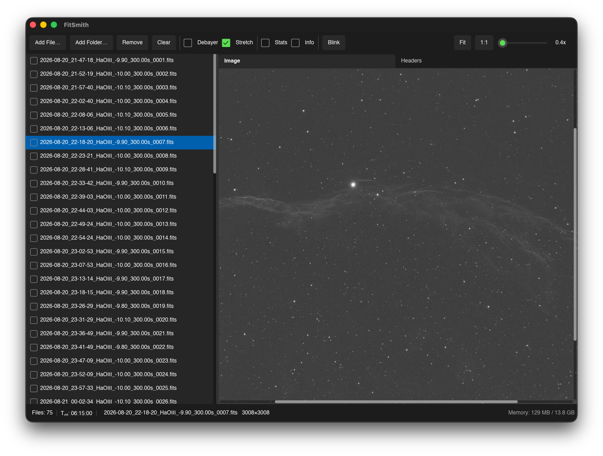

# FitSmith

FitSmith is a desktop FITS file viewer.

It allows preview of multiple FITS files with debayering and screen stretch, if necessary.



## Features

 - View FITS file. duh.
 - Blink through the working set of the FITS files.
 - Batch export FITS to JPG, PNG or TIFF
 - Batch compression or decompression of FITS files
 - View headers
 - View statistics: Mean, median, standard deviation, MAD, contrast, etc.
 - Estimate real bit depth of the file
 - View star metrics (HFR, FWHM, Eccentricity)
 - Aberration inspector
 - Detect bad frames: flag frames that are outliers against the session's baseline — noise, focus issues or tracking failure 
 - Charts:
   - draw a chart of a statistics metrics for the whole working set - see how star count or noise levels changed during the session
   - show the mean value of the chart metrics and ±1, 2 and 3σ to quickly see which images are outliers

For example here is the mean pixel value chart clearly showing when the wildfire smoke arrived and affected seeing and total brightness


## Installing

FitSmith is distributed as a native installer per OS (`.dmg` on macOS, `.deb`/`.rpm` on Linux,
`.zip` with portable .exec on Windows). You can check the releases on the [GitHub](https://github.com/uaraven/fitz/releases) 
or build the package yourself — see [Building FitSmith](building.md) for instructions.

Packages are unsigned — no Apple Developer ID or Windows code-signing certificate is used — so first launch shows a warning.

### macOS

To install, open the DMG and copy to the Applications folder to run the application

**Note**: macOS will block the application from running because it is not notarized. You **will** 
need to allow it in System Preferences -> Security & Privacy -> General or using the terminal command:

```
sudo xattr -rd com.apple.quarantine /Applications/FitSmith.app
```

### Linux

Install using package installer of your distro.

```shell                                   
sudo apt install fitsmith-<version>.deb

sud dnf install fitsmith-<version>.rpm
```
                              
### Windows

At this moment Windows version of FitSmith is distributed as a portable .exe file. Download, unzip and run. 

### Build from sources

You can also run FitSmith straight from source without packaging it — see
[Building FitSmith](building.md#building-and-running).

## Licensing

FitSmith's user interface is built with [Slint](https://slint.dev/) under the GNU General
Public License, version 3 (GPLv3), so FitSmith binaries are distributed under those terms. See
[Building FitSmith](building.md#slint-and-licensing) for details.
