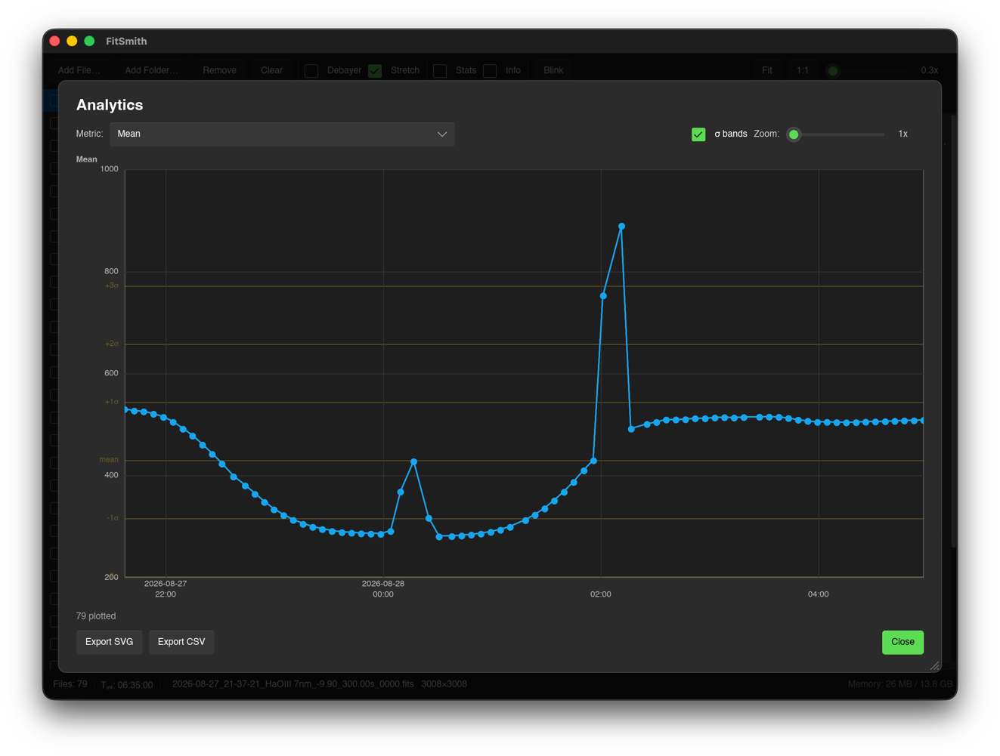

# FitSmith

FitSmith is a desktop FITS file viewer.

It allows preview of multiple FITS files with debayering and screen stretch, if necessary.

## What it does

 - View FITS file. duh.
 - Blink through the working set of the FITS files.
 - Batch export FITS to JPG, PNG or TIFF
 - Batch compression or decompression of FITS files
 - View headers
 - View statistics: Mean, median, standard deviation, MAD, etc.
 - Estimate real bit depth of the file
 - View star metrics (HFR, FWHM, Eccentricity)
 - Aberration inspector
 - Charts: 
   - draw a chart of a statistics metrics for the whole working set - see how star count or noise levels changed during the session
   - show the mean value of the chart metrics and ±1, 2 and 3σ to quickly see which images are outliers 

For example here is the mean pixel value chart clearly showing when the wildfire smoke arrived and affected seeing and total brightness


## Building and running

FitSmith is part of the `fitz` Cargo workspace:

```shell
cargo run -p fitsmith                 # run the GUI
cargo build -p fitsmith --release     # build a release binary
```

You can also pass files or folders on the command line to seed the working set:

```shell
cargo run -p fitsmith -- path/to/images/
```

## Packaging

FitSmith can be packaged as a native installer per OS via [`cargo-bundle`](https://github.com/burtonageo/cargo-bundle)
(install once with `cargo install cargo-bundle`). Two wrapper scripts drive it — there's no
CI, since Slint's per-OS windowing/font dependencies mean each package has to be built on
that OS:

```shell
./build/package-unix.sh        # macOS -> .dmg, Linux -> .deb + .rpm
./build/package-windows.ps1    # Windows -> .msi (needs the WiX Toolset on PATH)
```

On Linux, building the `.rpm` needs `rpmbuild` on `PATH` (`sudo dnf install rpm-build` on
Fedora/RHEL, `sudo apt install rpm` on Debian/Ubuntu); the script skips it with an install
hint if missing, and still builds the `.deb`.

Output lands under `target/release/bundle/<osx|deb|rpm|msi>/`. Packages are unsigned — no Apple
Developer ID or Windows code-signing certificate is used — so first launch shows a Gatekeeper
warning on macOS (right-click the app -> Open) and a SmartScreen warning on Windows (More
info -> Run anyway). 

The macOS bundle registers FitSmith as an "Open With" handler for `.fit`/`.fits`/`.fit.fz`/
`.fits.fz` 

Because FitSmith links Slint under the GPLv3 (see below), any packaged binary you distribute
carries that obligation — see [Slint and licensing](#slint-and-licensing).

## Slint and licensing

FitSmith's user interface is built with [Slint](https://slint.dev/). Slint is available under
several licenses; FitSmith uses it under the **GNU General Public License, version 3 (GPLv3)**.
Because of this, distributing FitSmith binaries is subject to the terms of the GPLv3. The rest
of the `fitz` project (the `libfitz` library and the `fitz` CLI) remains under the MIT
license — see [LICENSE](../LICENSE).
