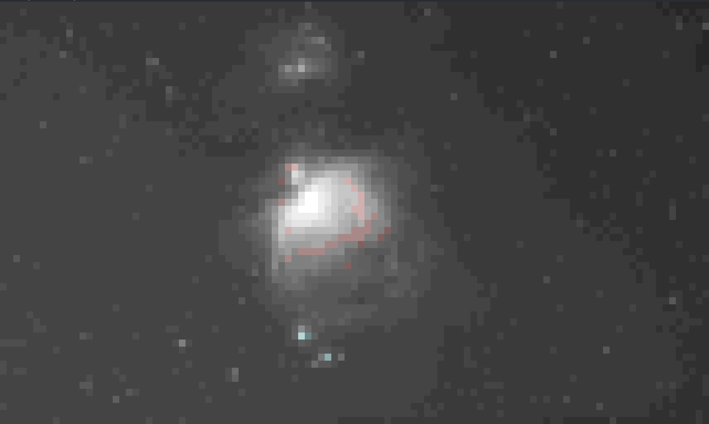
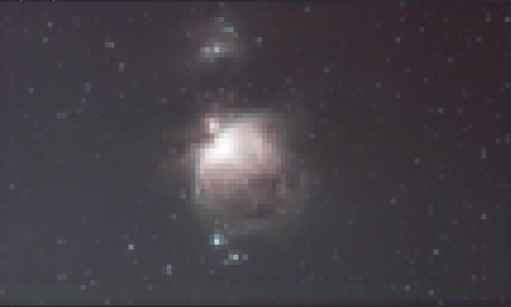
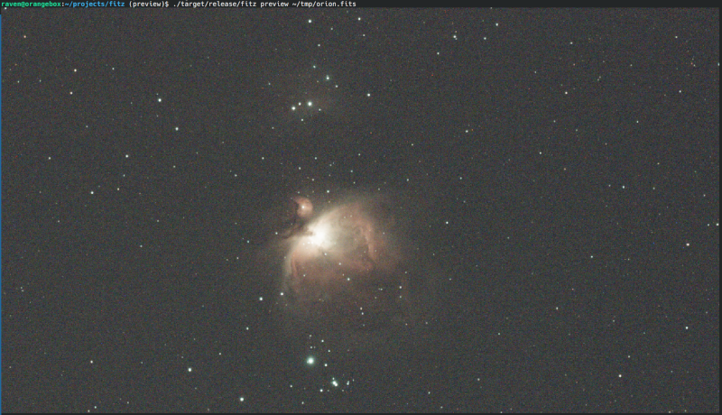

# fitz

Fitz is a CLI utility for working with FITS (astronomic images) files.

Fitz supports following operations on FITS files:
 - compression using RICE_1 and GZIP1/2 algorithms
 - decompression using the same algorithms
 - debayering a mosaic image and saving it as a FITS, TIFF, PNG or JPEG file
 - auto-stretching an image and saving it as a FITS, TIFF, PNG or JPEG file
 - Split FITS file into separate per-channel R,G,B files, debayering if needed. 
 - Preview fits file in terminal window
 - Copy FITS header keywords from one file onto another

I started fitz to quickly uncompress files created by NINA, because some of the tools and Siril scripts have problems with compressed files, after couple of days the project expanded into what it is now.

## Usage

```shell
fitz [options] COMMAND [command-options]
```

`options`:
 - `-v`, `--verbose` - print each file being processed
 - `-j`, `--jobs` - number of files to process in parallel (default: number of CPU cores)
 - `-V`, `--version` - print the application name and version, then exit
 - `-h`, `--help` - print help

When a command is given several input files, they are processed in parallel across up to `--jobs` worker threads (defaulting to the number of CPU cores). Each file is independent, so a failure on one file is reported and the rest still run. Pass `-j 1` to force sequential processing. 

`COMMAND` - one of the following:
 - `compress` to compress the FITS file;
 - `decompress` to decompress the compressed FITS file;
 - `debayer` to debayer a FITS mosaic image and save it as a FITS, TIFF, PNG or JPEG file;
 - `stretch` to auto-stretch a FITS image and save it as a FITS, TIFF, PNG or JPEG file;
 - `split` to debayer a FITS mosaic image (or split an already-debayered RGB image) and save each color channel as a separate FITS file;
 - `info` to print a summary of a FITS file (resolution, bit depth, channels, sky coordinates, pixel statistics, star metrics);
 - `preview` to preview FITS file in terminal. fitz will debayer (if needed) and stretch the image and then print it to the terminal using the best quality mode available. See [Preview section](#preview) for more details.
 - `copy-header` to copy FITS header keywords from a source file onto a target file, filling in only what the target doesn't already have.

 Use `--help` parameter with any command to see more options.

### compress

```
Usage: fitz compress [OPTIONS] [FILES]...

Arguments:
  [FILES]...  FITS files to compress

Options:
  -k, --keep                   Keep original file after compression
  -y, --yes                    Assume yes to overwrite question
  -a, --algorithm <ALGORITHM>  Compression algorithm [default: rice1] [possible values: rice1, gzip1, gzip2]
  -o, --output <OUTPUT>        Write output to this file (only valid with a single input file)
  -v, --verbose                Print each file being processed
  -j, --jobs <JOBS>            Number of files to process in parallel (default: number of CPU cores)
  -h, --help                   Print help
```

### decompress

```
Usage: fitz decompress [OPTIONS] [FILES]...

Arguments:
  [FILES]...  FITS files to decompress

Options:
  -k, --keep             Keep original file after decompression
  -y, --yes              Assume yes to overwrite question
  -o, --output <OUTPUT>  Write output to this file (only valid with a single input file)
  -v, --verbose          Print each file being processed
  -j, --jobs <JOBS>      Number of files to process in parallel (default: number of CPU cores)
  -h, --help             Print help
```

Decompression restores the original image header, keeping its metadata (including `BAYERPAT`) and stripping only the compressed-container table/`Z*` keywords, so a `compress` → `decompress` round-trip preserves the header.

### debayer

Debayers a FITS mosaic image and saves it as a FITS (3-channel), TIFF, PNG or JPEG file. The Bayer pattern is always read from the file's `BAYERPAT` header — there is no `--pattern`/`--force-demosaic` override for this command. If the input is not a raw mosaic (it's already a 3-plane RGB image, or a 1-channel image with no `BAYERPAT` header), `debayer` refuses with an error rather than writing a copy.

When `-o`/`--output` is not given, the output file is named `{input-stem}_debayer.{ext}` next to the input, where `ext` depends on `--output-format`.

```
Usage: fitz debayer [OPTIONS] [FILES]...

Arguments:
  [FILES]...  FITS files to debayer

Options:
  -y, --yes                     Assume yes to overwrite question
      --bpp <BPP>               Bits per pixel in the output image (TIFF and FITS only) [default: 16] (8, 16 or 32)
      --compress                Compress the output image (currently only affects FITS output's tile compression; TIFF and PNG output ignore it)
      --quality <QUALITY>       JPEG export quality 0..100 [default: 90] (only used with --output-format jpeg)
  -f, --output-format <FORMAT>  Output file format [default: fits] [possible values: fits, tiff, jpeg, png]
  -o, --output <OUTPUT>         Write output to this file, or to this folder if processing multiple files
  -v, --verbose                 Print each file being processed
  -j, --jobs <JOBS>             Number of files to process in parallel (default: number of CPU cores)
  -h, --help                    Print help
```

`--bpp` selects the sample width of FITS (8/16/32-bit unsigned) and TIFF (8/16/32-bit) output; it has no effect on PNG (always 16-bit) or JPEG (always 8-bit) output.

### stretch

Applies an automatic screen-transfer-function (STF/MTF) stretch to a FITS image and saves the result as a FITS, TIFF, PNG or JPEG file.

**`stretch` does not debayer the input.** It stretches whatever it's given, in place: a raw CFA mosaic is stretched (and saved back out) as a mosaic, an already-debayered RGB cube is stretched as RGB, and a monochrome frame is stretched as monochrome. Run `debayer` first if you want a stretched RGB image from raw sensor data. `--pattern`/`--force-demosaic` are still accepted for backward compatibility but currently have no effect on `stretch` (a warning is printed); the Bayer pattern is always read from the `BAYERPAT` header.

The stretch derives its shadows clip and midtones balance from each image's own statistics (median and median absolute deviation), pulling the background up to a consistent target brightness. By default each color channel (of an RGB or CFA image) is stretched independently, which also neutralizes the background color cast. Pass `--linked-channel` to apply one shared stretch to all channels instead, preserving the original color balance.

The target background brightness defaults to `0.25` (of the full `[0, 1]` range); pass `--brightness` with a higher value (strictly between 0 and 1) if the stretched image still looks too dark, or a lower value to darken it.

FITS output is written as 32-bit float, normalized to `[0, 1]`; TIFF is written as 16-bit, and PNG as 16-bit; JPEG is written as 8-bit at quality 90.

When `-o`/`--output` is not given, the output file is named `{input-stem}_stretch.{ext}` next to the input, where `ext` depends on `--output-format`.

```
Usage: fitz stretch [OPTIONS] [FILES]...

Arguments:
  [FILES]...  FITS files to stretch

Options:
  -y, --yes                      Assume yes to overwrite question
      --linked-channel           Apply one shared stretch to all channels instead of stretching each channel independently (which also neutralizes the background)
      --pattern <PATTERN>        Bayer pattern of the sensor; currently has no effect on stretch [possible values: RGGB, GBRG, BGGR, GRBG]
      --force-demosaic           Currently has no effect on stretch
      --brightness <BRIGHTNESS>  Target background brightness the auto-stretch pulls the image towards (strictly between 0 and 1); higher values produce a brighter image [default: 0.25]
  -f, --output-format <FORMAT>   Output file format [default: fits] [possible values: fits, tiff, jpeg, png]
  -o, --output <OUTPUT>          Write output to this file, or to this folder if processing multiple files
  -v, --verbose                  Print each file being processed
  -j, --jobs <JOBS>              Number of files to process in parallel (default: number of CPU cores)
  -h, --help                     Print help
```

### split

Debayers a FITS mosaic image and saves each color channel as a separate FITS file. An already-debayered 3-plane RGB image is split directly, without debayering. A 2D image with no Bayer pattern header is neither, so it has nothing to split and `split` errors on it.

`--pattern`/`--force-demosaic` are still accepted for backward compatibility but currently have no effect on `split` (a warning is printed); the Bayer pattern is always read from the `BAYERPAT` header.

`--r-prefix`/`--r-dir` (and the `g`/`b` equivalents) are mutually exclusive. If none of the six prefix/dir options are given, all three channels are saved next to the input file using the default `R-`/`G-`/`B-` prefixes. If any are given, only the explicitly configured channels are saved. In directory mode the original filename is kept unchanged (use distinct directories per channel to avoid one channel overwriting another), and the directory is created automatically if it doesn't already exist.

```
Usage: fitz split [OPTIONS] [FILES]...

Arguments:
  [FILES]...  FITS files to split into channels

Options:
  -y, --yes                  Assume yes to overwrite question
  -p, --output-pixel-format <FORMAT>
                             Per-channel pixel format of the resulting FITS files [default: i16] [possible values: i8, i16, i32, f32, f64]
      --pattern <PATTERN>    Bayer pattern of the sensor; currently has no effect on split [possible values: RGGB, GBRG, BGGR, GRBG]
      --force-demosaic       Currently has no effect on split
      --cfa                  Extract R, G and B straight from a raw (non-debayered) mosaic instead of debayering first: each output is half the input's width and height, and green is the average of the two green sensor sites. Errors if the input is already debayered
      --r-prefix <R_PREFIX>  Prefix for the red channel file: {prefix}-{original-file-name}
      --r-dir <R_DIR>        Directory to save the red channel file into (original filename kept)
      --g-prefix <G_PREFIX>  Prefix for the green channel file: {prefix}-{original-file-name}
      --g-dir <G_DIR>        Directory to save the green channel file into (original filename kept)
      --b-prefix <B_PREFIX>  Prefix for the blue channel file: {prefix}-{original-file-name}
      --b-dir <B_DIR>        Directory to save the blue channel file into (original filename kept)
  -v, --verbose              Print each file being processed
  -j, --jobs <JOBS>          Number of files to process in parallel (default: number of CPU cores)
  -h, --help                 Print help
```

### info

Prints a human-readable summary of each FITS file without writing anything. Reported fields:

 - **Resolution** — image width × height.
 - **Bit depth** — the pixel storage format read from the decoded pixel buffer itself (`16-bit unsigned integer` or `32-bit float`) — correct even for a tile-compressed input, unlike the header's own `BITPIX`, which for a compressed HDU describes its binary table rather than the image.
 - **Channels** — channel count and layout: `3 (debayered RGB)`, `1 (mosaic)` for a raw CFA frame, or `1 (monochrome (debayered))` for an already-debayered mono frame with no `BAYERPAT` header.
 - **Bayer** — the Bayer/CFA pattern, shown for raw mosaics.
 - **Object** — the target name (`OBJECT`).
 - **RA / DEC** — image-center sky coordinates, when present. 
 - **Rotation** — object/camera rotation angle in degrees.
 - **Exposure** — exposure time in seconds.
 - **Gain / Offset** — camera gain and offset.
 - **Binning** — sensor binning.
 - **Filter** — the filter name.
 - **Instrument** — the camera/sensor name.
 - **Telescope** — the telescope name followed, when available, by its focal length and focal ratio.
 - **Date-obs** — the observation timestamp.

Each of the above is only shown when the corresponding header keyword is present (and non-blank). By default only these header-derived fields are reported.

Pass `--pixels` to additionally read the pixel data (transparently decompressing a tile-compressed input first) and print a table of per-channel statistics — one column for a raw mosaic or monochrome frame, three (`R`/`G`/`B`) for an already-debayered RGB cube:

 - **Min / Max** — the physical pixel value extremes.
 - **Mean** — the arithmetic mean.
 - **Median** — the (approximate) median.
 - **Mode** — the most common pixel value, which for a typical sky frame is the background level. Ties resolve to the lowest such value, so a bimodal frame (e.g. amp glow) reports the sky peak rather than the glow.
 - **Avg Dev** — the mean absolute deviation from the mean.
 - **MAD** — the median absolute deviation from the median (scaled by 1.4826, so it estimates the standard deviation for Gaussian noise) — a selection rather than a sum, so a handful of bright outliers cannot move it.
 - **σ** — the standard deviation of every pixel, so stars, hot pixels and satellite trails all inflate it. Reported together with `MAD` because the gap between them is itself the interesting number: on a clean frame the two are close; a `σ` well above `MAD` means signal (or trouble) rather than redundancy.
 - **Bit-depth (est)** — the sample bit depth (8, 10, 12, 14 or 16) guessed from the channel's own max pixel value, independent of the file's nominal `Bit depth`.
 - **Zeros** — the count of pixels whose value is exactly zero (crunched shadows).
 - **Saturated** — the count of pixels at the channel's estimated full scale (blown highlights) — the ceiling implied by `Bit-depth (est)`, not a fixed 65535/255 or a `DATAMAX` header keyword.
 - **Histogram** — one combined histogram (luma-weighted for an RGB cube, so it isn't three overlapping charts) is drawn last, after the table. Pass `--log` for a logarithmic vertical axis, which keeps a tall low-value spike (common in astronomical frames) from flattening the rest of the distribution. `--log` only affects the histogram, so it is only useful together with `--pixels`.

Pass `--stars` to detect the frame's stars and report:

 - **`count`** — how many stars were detected. Fewer stars than the frames around it usually means cloud or haze.
 - **`hfr`** — the half-flux radius, the flux-weighted mean radius of a star. The focus metric: the smaller, the sharper.
 - **`fwhm`** — the full width at half maximum, from the stars' second moments. Tracks focus and seeing alongside `hfr`.
 - **`eccentricity`** — how elongated the stars are, from 0 (round) to nearly 1 (a streak). Rising eccentricity means tracking or guiding trouble. Note that it is a steep scale near the round end: stars only 10% wider one way than the other already read 0.42, so a mid-range number is a mild elongation, not a bad frame.

`count`, `hfr` and `fwhm` are medians across the accepted stars, so one satellite trail cannot move the number. Eccentricity is aggregated differently — the stars' elongation *directions* are averaged along with their magnitudes — because a per-star eccentricity can only ever be pushed upwards by noise, so a plain median of them reports faint frames as elongated when they are not. The trade-off is that elongation which fans out symmetrically across the frame, such as pure field rotation about the centre, partly cancels; elongation that points the same way everywhere, which is what trailing and drift produce, is reported in full.

Blobs that are too small (hot pixels), too large (nebulosity), clipped at the sensor's ceiling, or touching the frame border are rejected before measuring — a saturated or truncated star has no usable shape.

`--stars` is independent of `--pixels` in both directions: neither implies the other (star detection derives its threshold from its own detection plane, never from the frame's pixel statistics). For an already-debayered RGB cube detection runs on the green channel.

**On a colour (CFA) frame, `hfr` and `fwhm` are in half-resolution pixels** — roughly half the number NINA reports for the same frame. A star sampled through a Bayer filter is not a point-spread function, so detection runs on the green super-pixel plane, where each pixel averages one 2x2 cell's two green sites. Every frame in a session comes off the same sensor, so the trend — which is what these numbers are for — is unaffected. An already-debayered RGB cube instead has a separated green channel, so detection runs on it at *full* resolution — its `hfr`/`fwhm` read about twice a raw mosaic's. (This distinction is background, not something the printed report calls out itself.)

Pass `--headers` to skip the formatted summary entirely and instead dump the raw FITS header cards, one per line, exactly as found in the file.

```
Usage: fitz info [OPTIONS] [FILES]...

Arguments:
  [FILES]...  FITS files to inspect

Options:
      --pixels       Read the pixel data (decompressing first if needed) and report pixel statistics
      --stars        Detect the frame's stars and report their count and median HFR, FWHM and eccentricity. Independent of --pixels in both directions
      --log          Use a logarithmic vertical axis for the pixel histogram. Only useful together with --pixels, which is what produces the histogram
      --headers      Print the raw FITS header cards instead of the formatted summary
  -v, --verbose      Print each file being processed
  -j, --jobs <JOBS>  Number of files to process in parallel (default: number of CPU cores)
  -h, --help         Print help
```

### preview

Renders a FITS image directly in the terminal instead of writing a file. The image is loaded, debayered if needed, auto-stretched, downscaled to fit the terminal, and printed as colored text — a quick way to eyeball a frame over SSH or without opening a viewer.

The image is stretched before printing; `--linked-channel` and `--brightness` behave the same as for the `stretch` command. Unlike `stretch`, `preview` always debayers a raw mosaic first (unless `--no-debayer` is given) before stretching it. `--pattern`/`--force-demosaic` are still accepted for backward compatibility but currently have no effect (a warning is printed); the Bayer pattern is always read from the `BAYERPAT` header.

Unlike the other commands, `preview` accepts exactly one file.

`preview` requires terminal to support at least 216-color mode or better. If terminal is unable to render more than 16 colors, the preview will not work.

If terminal supports Kitty Terminal graphics protocol, the preview will be shown as a picture, otherwise for terminals that support true-color mode the preview will use it. If true-color mode is not supported, then the preview will fall back to 216-color mode. The quality is not good, but might be enough to have a quick look at the image.

Automatic terminal graphics detection is supported on Linux and macOS. On other platforms, use `--graphics` to force the Terminal graphics protocol when your terminal supports it.

|          Fallback mode           |       True-color mode       |         Graphics mode          |
| :------------------------------: | :-------------------------: | :----------------------------: |
|  |  |  |

Two flags override the default behaviour:

 - `--graphics` forces the Kitty terminal graphics protocol even if detection is skipped or inconclusive (useful when your terminal supports it but doesn't answer the capability query).
 - `--truecolor` forces true-color ANSI half-block rendering instead of the terminal graphics protocol.

These two flags are mutually exclusive.

`--no-debayer` skips debayering: a raw, not-yet-debayered mosaic is shown as a stretched grayscale image using its raw sensor values instead of being color-interpolated. If the image is already debayered (or already monochrome), there's nothing to skip, so the flag is ignored and a warning is printed instead.

```
Usage: fitz preview [OPTIONS] <FILE>

Arguments:
  <FILE>  FITS file to preview (only a single file is accepted)

Options:
      --linked-channel     Apply one shared stretch to all channels instead of stretching each channel independently (which also neutralizes the background)
      --pattern <PATTERN>  Bayer pattern of the sensor; currently has no effect on preview [possible values: RGGB, GBRG, BGGR, GRBG]
      --force-demosaic     Currently has no effect on preview
      --brightness <BRIGHTNESS>
                           Target background brightness the auto-stretch pulls the image towards (strictly between 0 and 1); higher values produce a brighter image [default: 0.25]
      --graphics           Force kitty graphics protocol rendering, skipping auto-detection
      --truecolor          Force true-color ANSI half-block rendering, skipping auto-detection
      --fallback           Force compatibility fallback ASCII rendering using only 216 colours
      --no-debayer         Skip debayering, showing a raw mosaic as a stretched grayscale image instead; ignored (with a warning) if already debayered
  -v, --verbose            Print each file being processed
  -j, --jobs <JOBS>        Number of files to process in parallel (default: number of CPU cores)
  -h, --help               Print help
```

### copy-header

Copies FITS header keywords from `SOURCE` onto `TARGET`, filling in only the keywords `TARGET` doesn't already carry. `TARGET`'s own resolution, bit depth, channel count, pixel scaling, and any other keyword it already has are left untouched — only missing metadata (object name, sky coordinates, filter, gain, HISTORY/COMMENT cards, …) is added. If `TARGET` is already a debayered 3-plane image, `BAYERPAT` (and the related CFA offset keywords) from `SOURCE` is skipped even if missing, so `TARGET` doesn't start looking like undebayered raw sensor data again.
By default `TARGET` is modified in place; pass `-o`/`--output` to write the result to a different file instead, leaving `TARGET` untouched.

```
Usage: fitz copy-header [OPTIONS] <SOURCE> <TARGET>

Arguments:
  <SOURCE>  FITS file to copy header keywords from
  <TARGET>  FITS file to copy header keywords into (modified in place unless --output is given)

Options:
  -y, --yes              Assume yes to overwrite question
  -o, --output <OUTPUT>  Write the result to this file instead of overwriting the target in place
  -v, --verbose          Print each file being processed
  -j, --jobs <JOBS>      Number of files to process in parallel (default: number of CPU cores)
  -h, --help             Print help
```
