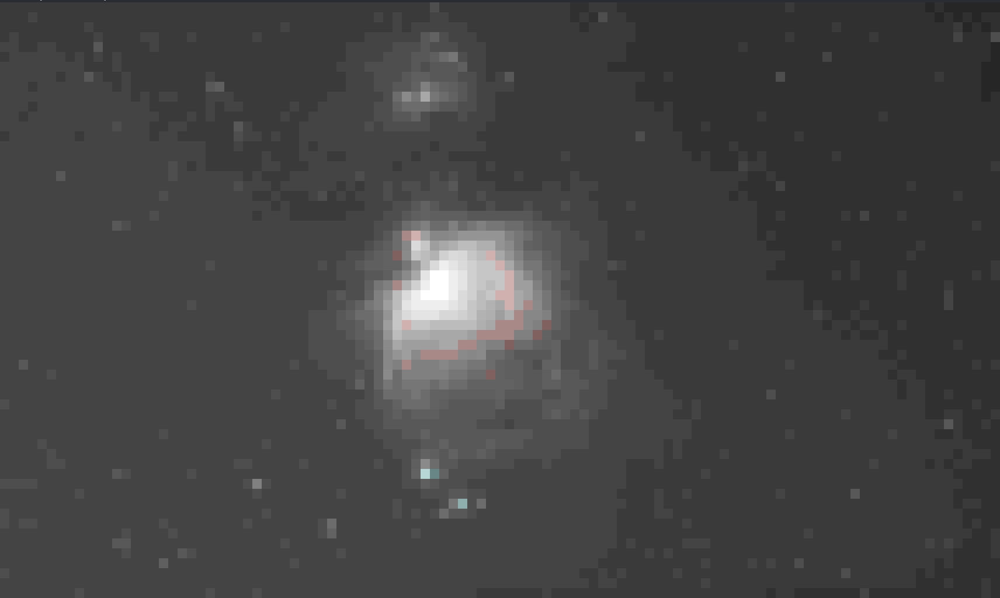
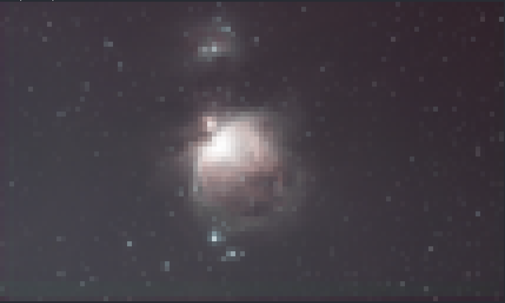
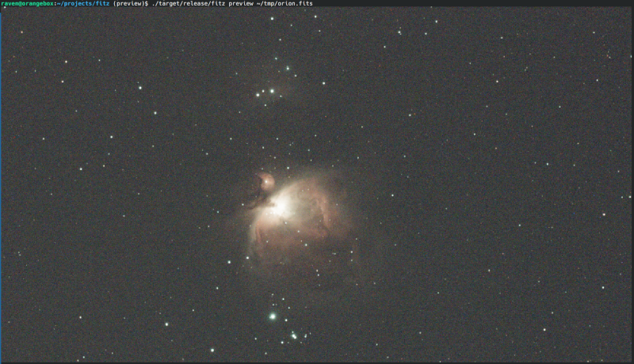

# fitz

Fitz is a CLI utility for working with FITS (astronomic images) files. 

Fitz supports following operations on FITS files:
 - compression using RICE_1 and GZIP1/2 algorithms
 - decompression using the same algorithms
 - debayering a mosaic image and saving it as a FITS  or TIFF file
 - auto-stretching an image (debayering it first if needed) and saving it as a FITS or TIFF file
 - Split FITS file into separate per-channel R,G,B files, debayering if needed. 
 - Preview fits file in terminal window
 - Copy FITS header keywords from one file onto another

I started fitz to quickly uncompress files created by NINA, because some of the tools and Siril scripts have problems with compressed files, after couple of days the project expanded into what it is now.

## Usage

```shell
fitz [options] COMMAND [command-options]
```

`options`:
 - `-v`, `--verbose` - print each file being processed
 - `-j`, `--jobs` - number of files to process in parallel (default: number of CPU cores)
 - `-V`, `--version` - print the application name and version, then exit
 - `-h`, `--help` - print help

When a command is given several input files, they are processed in parallel across up to `--jobs` worker threads (defaulting to the number of CPU cores). Each file is independent, so a failure on one file is reported and the rest still run. Pass `-j 1` to force sequential processing. 

`COMMAND` - one of the following:
 - `compress` to compress the FITS file;
 - `decompress` to decompress the compressed FITS file;
 - `debayer` to debayer a FITS mosaic image and save it as a FITS or TIFF file;
 - `stretch` to auto-stretch a FITS image (debayering it first if needed) and save it as a FITS or TIFF file;
 - `split` to debayer a FITS mosaic image (or split an already-debayered RGB image) and save each color channel as a separate FITS file;
 - `info` to print a summary of a FITS file (resolution, bit depth, channels, sky coordinates, pixel statistics);
 - `preview` to preview FITS file in terminal. fitz will debayer (if needed) and stretch the image and then print it to the terminal using the best quality mode available. See [Preview section](#preview) for more details.
 - `copy-header` to copy FITS header keywords from a source file onto a target file, filling in only what the target doesn't already have.

 Use `--help` parameter with any command to see more options.

### compress

```
Usage: fitz compress [OPTIONS] [FILES]...

Arguments:
  [FILES]...  FITS files to compress

Options:
  -k, --keep                   Keep original file after compression
  -y, --yes                    Assume yes to overwrite question
  -a, --algorithm <ALGORITHM>  Compression algorithm [default: rice1] [possible values: rice1, gzip1, gzip2]
  -o, --output <OUTPUT>        Write output to this file (only valid with a single input file)
  -v, --verbose                Print each file being processed
  -j, --jobs <JOBS>            Number of files to process in parallel (default: number of CPU cores)
  -h, --help                   Print help
```

### decompress

```
Usage: fitz decompress [OPTIONS] [FILES]...

Arguments:
  [FILES]...  FITS files to decompress

Options:
  -k, --keep             Keep original file after decompression
  -y, --yes              Assume yes to overwrite question
  -o, --output <OUTPUT>  Write output to this file (only valid with a single input file)
  -v, --verbose          Print each file being processed
  -j, --jobs <JOBS>      Number of files to process in parallel (default: number of CPU cores)
  -h, --help             Print help
```

Decompression restores the original image header, keeping its metadata (including `BAYERPAT`) and stripping only the compressed-container table/`Z*` keywords, so a `compress` → `decompress` round-trip preserves the header.

### debayer

Debayers a FITS mosaic image and saves it as a FITS (3-channel) or TIFF file. The Bayer pattern is retrieved from the FITS headers and can be overwritten with `--pattern` parameter. If the input file is already a 3-plane RGB image, the demosaic step is skipped and a notice is printed to stdout. Likewise, a 1-channel image with no `BAYERPAT` header is assumed to already be a debayered monochrome image; a warning is printed and the demosaic step is skipped. Pass `--force-demosaic` if an input is actually raw sensor data that happens to look like one of these cases, so it isn't silently skipped; this requires a Bayer pattern from either `--pattern` or the header.

When `-o`/`--output` is not given, the output file is named `{input-stem}_debayer.{ext}` next to the input, where `ext` is `fits` or `tiff` depending on `--format`.

FITS output always preserves the source image's pixel format, so `--bpp` only affects TIFF output, which is written as 8-, 16-, or 32-bit unsigned integers.

```
Usage: fitz debayer [OPTIONS] [FILES]...

Arguments:
  [FILES]...  FITS files to debayer

Options:
  -y, --yes                Assume yes to overwrite question
      --bpp <BPP>          Bits per pixel in the output image (TIFF only; FITS keeps the source format) [default: 16] (8, 16 or 32)
      --pattern <PATTERN>  Bayer pattern of the sensor; if omitted, read from the FITS BAYERPAT header [possible values: RGGB, GBRG, BGGR, GRBG]
      --force-demosaic     Always demosaic, even if the input looks like an already-debayered RGB image
  -f, --output-format <FORMAT>
                           Output file format [default: fits] (TIFF or FITS)
  -o, --output <OUTPUT>    Write output to this file, or to this folder if processing multiple files
  -v, --verbose            Print each file being processed
  -j, --jobs <JOBS>        Number of files to process in parallel (default: number of CPU cores)
  -h, --help               Print help
```

### stretch

Applies an automatic screen-transfer-function (STF/MTF) stretch to a FITS image and saves the 16-bit result as a FITS or TIFF file. The input is debayered first if needed, following the same rules as `debayer`.

The stretch derives its shadows clip and midtones balance from each image's own statistics (median and median absolute deviation), pulling the background up to a consistent target brightness. By default each color channel is stretched independently, which also neutralizes the background color cast. Pass `--linked-channel` to apply one shared stretch to all channels instead, preserving the original color balance.

The target background brightness defaults to `0.25` (of the full `[0, 1]` range); pass `--brightness` with a higher value (strictly between 0 and 1) if the stretched image still looks too dark, or a lower value to darken it.

When `-o`/`--output` is not given, the output file is named `{input-stem}_stretch.{ext}` next to the input, where `ext` is `fits` or `tiff` depending on `--format`.

```
Usage: fitz stretch [OPTIONS] [FILES]...

Arguments:
  [FILES]...  FITS files to stretch

Options:
  -y, --yes                Assume yes to overwrite question
      --linked-channel     Apply one shared stretch to all channels instead of stretching each channel independently (which also neutralizes the background)
      --pattern <PATTERN>  Bayer pattern of the sensor; if omitted, read from the FITS BAYERPAT header [possible values: RGGB, GBRG, BGGR, GRBG]
      --force-demosaic     Always demosaic, even if the input looks like an already-debayered RGB image
      --brightness <BRIGHTNESS>
                           Target background brightness the auto-stretch pulls the image towards (strictly between 0 and 1); higher values produce a brighter image [default: 0.25]
  -f, --output-format <FORMAT>
                           Output file format [default: fits] (TIFF or FITS)
  -o, --output <OUTPUT>    Write output to this file, or to this folder if processing multiple files
  -v, --verbose            Print each file being processed
  -j, --jobs <JOBS>        Number of files to process in parallel (default: number of CPU cores)
  -h, --help               Print help
```

### split

Debayers a FITS mosaic image and saves each color channel as a separate FITS file. If the input has no bayer pattern header, it's assumed to already be an RGB image and the debayer step is skipped. 

`--r-prefix`/`--r-dir` (and the `g`/`b` equivalents) are mutually exclusive. If none of the six prefix/dir options are given, all three channels are saved next to the input file using the default `R-`/`G-`/`B-` prefixes. If any are given, only the explicitly configured channels are saved. In directory mode the original filename is kept unchanged (use distinct directories per channel to avoid one channel overwriting another), and the directory is created automatically if it doesn't already exist.

```
Usage: fitz split [OPTIONS] [FILES]...

Arguments:
  [FILES]...  FITS files to split into channels

Options:
  -y, --yes                  Assume yes to overwrite question
  -p, --output-pixel-format <FORMAT>
                             Pixel format of the resulting per-channel FITS files [default: i16] [possible values: i8, i16, i32, f32, f64]
      --pattern <PATTERN>    Bayer pattern of the sensor; if omitted, read from the FITS BAYERPAT header [possible values: RGGB, GBRG, BGGR, GRBG]
      --force-demosaic       Always demosaic, even if the input looks like an already-debayered RGB image
      --r-prefix <R_PREFIX>  Prefix for the red channel file: {prefix}-{original-file-name}
      --r-dir <R_DIR>        Directory to save the red channel file into (original filename kept)
      --g-prefix <G_PREFIX>  Prefix for the green channel file: {prefix}-{original-file-name}
      --g-dir <G_DIR>        Directory to save the green channel file into (original filename kept)
      --b-prefix <B_PREFIX>  Prefix for the blue channel file: {prefix}-{original-file-name}
      --b-dir <B_DIR>        Directory to save the blue channel file into (original filename kept)
  -v, --verbose              Print each file being processed
  -j, --jobs <JOBS>          Number of files to process in parallel (default: number of CPU cores)
  -h, --help                 Print help
```

### info

Prints a human-readable summary of each FITS file without writing anything. Reported fields:

 - **Resolution** — image width × height.
 - **Bit depth** — Number of bits per pixel.
 - **Channels** — `3` for an already-debayered RGB, otherwise `1` (a raw mosaic, or an already-debayered monochrome frame when no `BAYERPAT` header is present).
 - **Bayer** — the Bayer/CFA pattern, shown for raw mosaics.
 - **RA / DEC** — image-center sky coordinates, when present. 
 - **Rotation** — object/camera rotation angle in degrees.
 - **Gain / Offset** — camera gain and offset.
 - **Binning** — sensor binning.
 - **Telescope** — the telescope name followed, when available, by its focal length and focal ratio.

Each of the above is only shown when the corresponding header keyword is present. By default only these header-derived fields are reported. 

Pass `--pixel` to additionally read the pixel data (transparently decompressing a tile-compressed input first) and print:

 - **Pixel statistics** — min, max, mean and median of the physical pixel values, plus the count of pixels whose value is exactly zero. Pixel statistics are not supported for already-debayered RGB images; for those a notice is printed instead.
 - **Histogram** — a histogram of the pixel values is drawn last, after the textual fields. Pass `--log` for a logarithmic vertical axis, which keeps a tall low-value spike (common in astronomical frames) from flattening the rest of the distribution. `--log` only affects the histogram, so it is only useful together with `--pixel`.

Pass `--headers` to skip the formatted summary entirely and instead dump the raw FITS header cards, one per line, exactly as found in the file.

```
Usage: fitz info [OPTIONS] [FILES]...

Arguments:
  [FILES]...  FITS files to inspect

Options:
      --pixel        Read the pixel data and report pixel statistics (not supported for debayered images)
      --log          Use a logarithmic vertical axis for the histogram (only useful with --pixel)
      --headers      Print the raw FITS header cards instead of the formatted summary
  -v, --verbose      Print each file being processed
  -j, --jobs <JOBS>  Number of files to process in parallel (default: number of CPU cores)
  -h, --help         Print help
```

### preview

Renders a FITS image directly in the terminal instead of writing a file. The image is loaded, debayered if needed, auto-stretched, downscaled to fit the terminal, and printed as colored text — a quick way to eyeball a frame over SSH or without opening a viewer.

The image is stretched before printing, same parameters as for `stretch` command apply here.

Unlike the other commands, `preview` accepts exactly one file.

`preview` requires terminal to support at least 216-color mode or better. If terminal is unable to render more than 16 colors, the preview will not work.

If terminal supports Kitty Terminal graphics protocol, the preview will be shown as a picture, otherwise for terminals that support true-color mode the preview will use it. If true-color mode is not supported, then the preview will fall back to 216-color mode. The quality is not good, but might be enough to have a quick look at the image.

Automatic terminal graphics detection is supported on Linux and macOS. On other platforms, use `--graphics` to force the Terminal graphics protocol when your terminal supports it.

|          Fallback mode           |       True-color mode       |         Graphics mode          |
| :------------------------------: | :-------------------------: | :----------------------------: |
|  |  |  |

Two flags override the default behaviour:

 - `--graphics` forces the Kitty terminal graphics protocol even if detection is skipped or inconclusive (useful when your terminal supports it but doesn't answer the capability query).
 - `--truecolor` forces true-color ANSI half-block rendering instead of the terminal graphics protocol.

These two flags are mutually exclusive.


```
Usage: fitz preview [OPTIONS] <FILE>

Arguments:
  <FILE>  FITS file to preview (only a single file is accepted)

Options:
      --linked-channel     Apply one shared stretch to all channels instead of stretching each channel independently (which also neutralizes the background)
      --pattern <PATTERN>  Bayer pattern of the sensor; if omitted, read from the FITS BAYERPAT header [possible values: RGGB, GBRG, BGGR, GRBG]
      --force-demosaic     Always demosaic, even if the input looks like an already-debayered RGB image
      --brightness <BRIGHTNESS>
                           Target background brightness the auto-stretch pulls the image towards (strictly between 0 and 1); higher values produce a brighter image [default: 0.25]
      --graphics           Force kitty graphics protocol rendering, skipping auto-detection
      --truecolor          Force true-color ANSI half-block rendering, skipping auto-detection
      --fallback           Force compatibility fallback ASCII rendering using only 216 colours
  -v, --verbose            Print each file being processed
  -j, --jobs <JOBS>        Number of files to process in parallel (default: number of CPU cores)
  -h, --help               Print help
```

### copy-header

Copies FITS header keywords from `SOURCE` onto `TARGET`, filling in only the keywords `TARGET` doesn't already carry. `TARGET`'s own resolution, bit depth, channel count, pixel scaling, and any other keyword it already has are left untouched — only missing metadata (object name, sky coordinates, filter, gain, HISTORY/COMMENT cards, …) is added. If `TARGET` is already a debayered 3-plane image, `BAYERPAT` (and the related CFA offset keywords) from `SOURCE` is skipped even if missing, so `TARGET` doesn't start looking like undebayered raw sensor data again.
By default `TARGET` is modified in place; pass `-o`/`--output` to write the result to a different file instead, leaving `TARGET` untouched.

```
Usage: fitz copy-header [OPTIONS] <SOURCE> <TARGET>

Arguments:
  <SOURCE>  FITS file to copy header keywords from
  <TARGET>  FITS file to copy header keywords into (modified in place unless --output is given)

Options:
  -y, --yes              Assume yes to overwrite question
  -o, --output <OUTPUT>  Write the result to this file instead of overwriting the target in place
  -v, --verbose          Print each file being processed
  -j, --jobs <JOBS>      Number of files to process in parallel (default: number of CPU cores)
  -h, --help             Print help
```

## Note

This is a small personal project and as such it is not thouroughly tested and not optimized in any way. Use at your own risk.

## License

MIT - see [LICENSE](LICENSE).

## AI Warning

I needed a quick and dirty tool to compress and uncompress fits files. Researching libraries, understanding FITS format and writing it myself would take time and I needed it now. The result is this tool is mostly vibe-coded with Claude Code. I review the code to make sure I understand what it does and I make changes where neccessary, but still most of the authorship goes to those anonymous heroes who write the code, on which Anthropic trains their models.

I understand the feelings a lot of people harbor towards AI-written code. I share a lot of these feelings, but, honestly, for a low-effort, low-impact and low-risk utility it kinda makes sense. I would spend at least a couple of weeks writing this or I could have what I need in two days.
