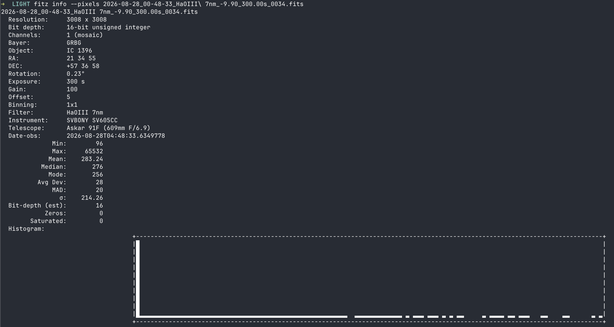
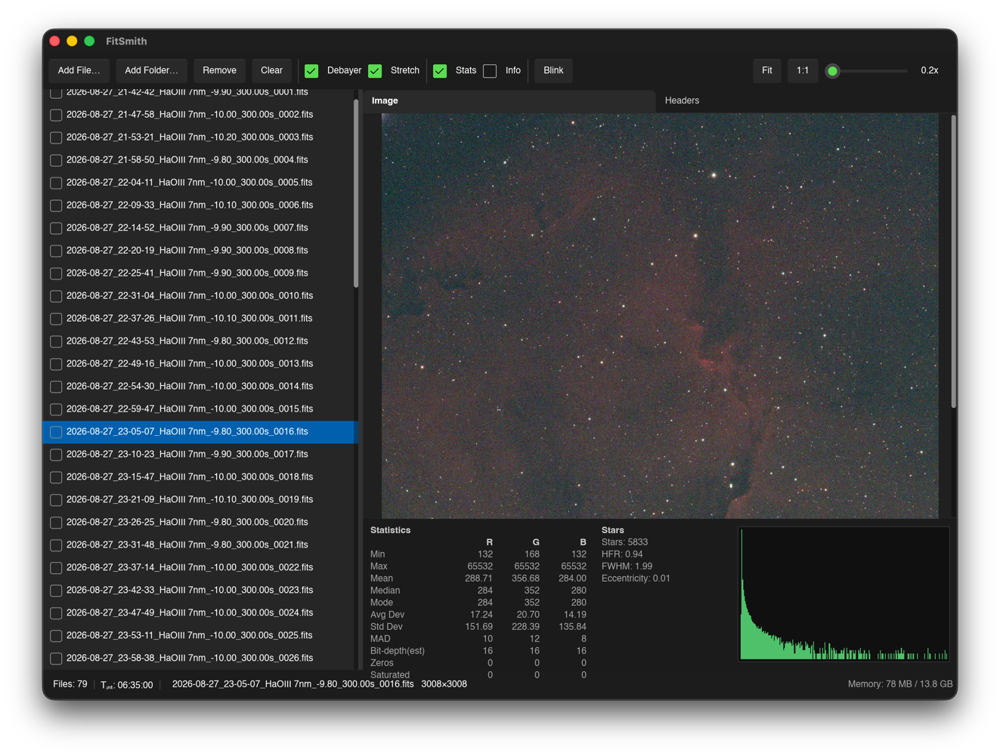

# fitz

`fitz` is a small toolset for working with FITS (astronomy image) files. It can compress and
decompress FITS files, debayer mosaic images, auto-stretch them, split them into per-channel
files, inspect headers and pixel statistics, and preview images.

I started fitz to quickly uncompress files created by NINA, because some of the tools and Siril
scripts have problems with compressed files; after a couple of days the project expanded into
what it is now.

## Components

The project consists for three major parts:

 - **[libfitz](libfitz)** — the reusable library: FITS I/O (with transparent
   tile-decompression), debayering, auto-stretch, per-channel splitting, header/pixel-stat
   inspection, header copying, and image resizing. Both frontends depend on it.
 - **[fitz](fitz-cli/readme.md)** — the command-line tool. See its
   [readme](fitz-cli/readme.md) for the full command and option reference.  
    
 - **[FitSmith](fitsmith/readme.md)** — a desktop GUI frontend built with Slint. See its
   [readme](fitsmith/readme.md) for details. 

## Note

This is a small personal project and as such it is not thoroughly tested and not optimized in
any way. Use at your own risk.

## License

MIT — see [LICENSE](LICENSE).

Note that the FitSmith GUI uses [Slint](https://slint.dev/) under the GPLv3 license; see
[fitsmith/building.md#slint-and-licensing](fitsmith/building.md#slint-and-licensing) for details.

## AI Warning

I needed a quick and dirty tool to compress and uncompress fits files. Researching libraries, understanding FITS format and writing it myself would take time and I needed it now. The result is this tool is mostly vibe-coded with Claude Code. I review the code to make sure I understand what it does and I make changes where necessary, but still most of the authorship goes to those anonymous heroes who write the code, on which Anthropic trains their models.

~~I understand the feelings a lot of people harbor towards AI-written code. I share a lot of these feelings, but, honestly, for a low-effort, low-impact and low-risk utility it kinda makes sense. I would spend at least a couple of weeks writing this or I could have what I need in two days.~~

~~Let's face it. AI isn't going anywhere (most likely). It's a new tool for us to use and it is a powerful tool. As long as we use it responsibly and own the outcomes I am going to treat it the same way as I treat compiler rewriting my code to improve performance.~~

After using the code for some time, I've discovered couple of bugs and I realized that I have no idea how to fix it, because I don't know how the code works. I could probably force my way through it by prompting LLM to "make it work like Siril", but I decided that's not the right way. 

I rewrote the core library by hand with LLM support for understanding and fixing bugs and major refactorings. After that I fixed the `fitz` CLI, as well by hand, using AI to validate my changes and sometimes generate unit tests.
                                            
`Fitsmith` is still partially vibe-coded, but I am adding new features manually and reviewing existing code.
